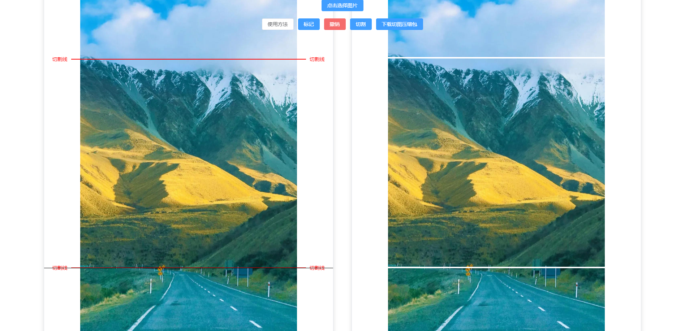

# 无名长图片自由分割/切割在线工具

## 项目介绍
在网上闲逛的时候发现有人需要长图自由分割工具，也没找到能用的，就想着自己写一个。

一开始想用类似视频剪辑拖动标记线来定位，但是没实现，目前只实现了点击标记。

纯前端实现无需网络

## 使用方法

1.点击 "选择图片" 按钮选择图片

2.在图片左侧预览区任意位置点击，黑色线条即会移动到这个为止然后点击 "标记" 按钮就会在当前海色线条停留位置生成一条红色的线来标记需要分割的位置

3.点击 "分割" 按钮开始分割，并将预览图展示出来

4.点击 "下载切图压缩包" 按钮即可下载分割好的图片压缩包

5.点击 "撤销" 按钮可撤销最近一次标记

6.点击 "重置" 按钮可重置（暂时没做，手动 F5 刷新）

## 演示图

 图一 

 图二 

 图三 

