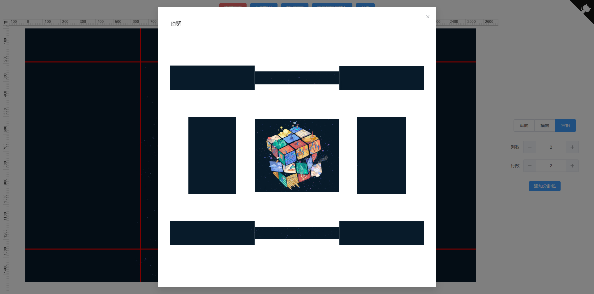

# 无名图片自由分割/切割在线工具-无名路人

## 项目介绍

支持图片自由纵向分割，横向分割，宫格分割，低仿 wps 看图图片分割。

主要是为了学习一下 LeaferJS 顺便升级一下之前的长图分割。

##### 使用技术

Vue3，LeaferJS，element-plus，file-saver，jszip，vueuse，pnpm

## 使用方法

拖动图片进去，点点点-按钮，拖拖拖-分割线就完事了。

## 演示图

 图一 

 图二 

## 地址

在线体验：
https://wumingluren.github.io/PicFreeCutter

源码地址：
https://github.com/wumingluren/PicFreeCutter
