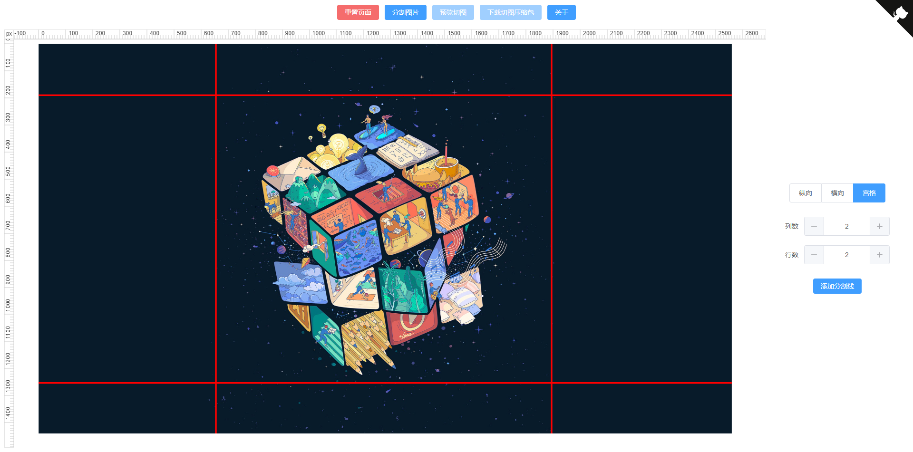
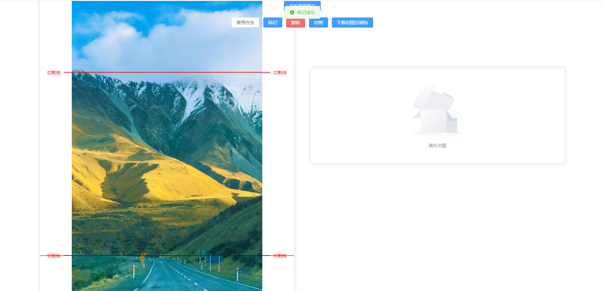

# 无名长图片自由分割/切割在线工具

## 项目介绍

在网上闲逛的时候发现有人需要长图片自由分割工具，也没找到能用的，就想着自己写一个，实现思路就是类似于视频剪辑的视频分割方式。

纯前端实现无需网络

##### 使用技术

Vue3，element-plus，pnpm，file-saver，jszip

## 使用方法

1.点击 "选择图片" 按钮选择图片，即可在左侧预览区预览图片

2.在左侧预览区任意位置点击，或者鼠标在黑色线条处按下拖动，黑色线条即会移动到目标位置，点击 "标记" 按钮就会在当前黑色线条停留位置生成一条红色的线来标记需要分割的位置

3.点击 "分割" 按钮开始分割，并在右侧将预览图展示出来

4.点击 "下载切图压缩包" 按钮即可下载分割好的图片压缩包

5.点击 "撤销" 按钮可撤销最近一次标记

6.点击 "重置" 按钮可重置（暂时没做，手动 F5 刷新）

## 演示图

 图一 

 图二 

## 地址
无名长图片自由分割/切割在线工具 

在线体验：
https://wumingluren.github.io/LongPicCutter

源码地址：
https://github.com/wumingluren/LongPicCutter

Windows： 
https://pan.baidu.com/s/1mwvwEe59Pd3n2GJ15Cs6rg?pwd=axjm 提取码: axjm 

Mac：暂无 Windows电脑打不了Mac的包
